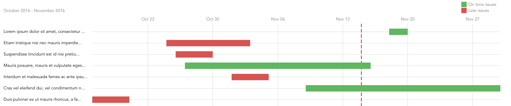

# GanttLab

The easy to use, fully functional Gantt chart for GitLab and GitHub.




## Run it now!

It is already running live for you at https://live.ganttlab.org.

- **GitLab** user? Type-in your GitLab instance URL (works with https://gitlab.com), your GitLab account [_Private Token_](https://gitlab.com/profile/account) or a [_Personal Access Token_](https://gitlab.com/profile/personal_access_tokens) and enjoy!
- working on **GitHub**? Provide one of your GitHub user [Personal access tokens](https://github.com/settings/tokens) to get the ride!

**Safe to run:** the application do NOT store any data, and runs on YOUR browser only, using your own network as if you were running all the requests to your GitLab instance or to GitHub right from your local computer. Unsure of it? Have a look at [the source code](https://gitlab.com/ganttlab/ganttlab-live/tree/master).

**PRO tip:** if you are running an unsecured HTTP instance of GitLab, head to http://live.ganttlab.org to avoid your browser blocking the request coming from an HTTPS secured site.

## How it works

_GanttLab_ is a **frontend only** application. It leverages [GitLab API](https://gitlab.com/help/api/README.md) or [GitHub API](https://developer.github.com/v3/) to read your issues, before simply displaying a Gantt chart with it.

The automatically generated [Gantt chart](https://en.wikipedia.org/wiki/Gantt_chart) will display each of your issues within a "date area": from a **start date**, to a **due date**.

To give you maximum control over your issues and tasks management practices in the gantt chart, you can override this default values **right from your issue description** with two simple [ISO 8601](https://en.wikipedia.org/wiki/ISO_8601#Calendar_dates) `YYYY-MM-DD` calendar dates:

```
GanttStart: 2016-09-26
GanttDue: 2016-10-25
```

The values of `GanttStart` and `GanttDue`, each on one dedicated line of your issue description (whether on top or bottom of the description), are considered as the _single source of truth_ if present to generate the gantt chart.

By default, a Gantt chart will be created without you having to update all of your issues descriptions to set those values: for each issue the **default start date** is read from the issue creation date. As with GitLab you are not forced to fill in a due date for your issues, and with GitHub you do not even have a due date on issues, here is the logic in place about the **default due date**:

1. if set, the `GanttDue` value is used first,
1. _(GitLab only)_ if this single source of truth is not set but you've set a due date on the issue itself, the issue due date will be used,
1. _(GitLab only)_ if your issue has no due date but is attached to a milestone that has a due date, the milestone due date is used,
1. ultimately, the _GanttLab_ **default due date** will be set to the day after the issue start date, faking all your issues having to be done in one day. 

Only your opened issues are displayed. If an issue due date is past, the issue is marked late and **colored red**. If not, the issue is **shown green** as being on time.

## Run it yourself

Whether you have Docker installed on your local computer ([download and install it](https://www.docker.com/products/docker)), you can try _GanttLab_ right now in four easy steps:

1. `git clone https://gitlab.com/ganttlab/ganttlab-live` will clone this repository
1. `cd ganttlab-live && ./bashInDevEnv.sh` to connect to the development environment
1. `./bootstrapIt.sh` within the dev environment. You will be prompted for your GitLab instance URL and your Private Token (Wanna try with your GitLab.com account? Your account Private Token [is here](https://gitlab.com/profile/account), or generate a Personal Access Token [out there](https://gitlab.com/profile/personal_access_tokens)!)
1. `npm run dev`: run _GanttLab_ right now, from the dev environment

Enjoy it on http://localhost:8080/! You may also read about the long version through [configuring](#configuring) and [installing](#installing).

## Configuring

The `./bootstrapIt.sh` script may already have configured the values prompted for you. See the [config](config) folder `*.example.js` files to persist your configuration for:

| Key                  | Description                                                                                                |
|----------------------|------------------------------------------------------------------------------------------------------------|
| `GITLAB_URL`         | your GitLab instance URL (defaults to https://gitlab.com)                                                  |
| `GITLAB_TOKEN`       | your GitLab user _Private Token_ or _Personal Access Token_ to use to connect to the                       |
| `MOMENTJS_LOCALE`    | Moment.js [locale configuration](http://momentjs.com/docs/#/i18n/) to display dates in your usual language |
| `GANTT_START_STRING` | defaults to `GanttStart: `, the string to search on you issue description as the gantt start date          |
| `GANTT_DUE_STRING`   | defaults to `GanttDue: `, the string to search on you issue description as the gantt due date              |

## Installing

Even if _GanttLab_ is a throw-away application **storing no data** on your hard drive, you can install it on a server to persist the gantt graph display service for your users.

Initial scaffolding was done with [vue-cli](https://github.com/vuejs/vue-cli) webpack template. For detailed explanation on how things work, checkout the [guide](http://vuejs-templates.github.io/webpack/) and [docs for vue-loader](http://vuejs.github.io/vue-loader). Simply said, this makes _GanttLab_ insanely powerful and ready to be run on production servers, or launched from your local computer within minutes:

``` bash
# install dependencies
npm install

# serve with hot reload at localhost:8080
npm run dev

# build for production with minification
npm run build
```

## What's next?

Without any obligation nor due date, one could expect to be done this non-exhaustive [list of improvements grouped on issues labeled `Feature`](https://gitlab.com/ganttlab/ganttlab-live/issues?scope=all&state=opened&utf8=%E2%9C%93&label_name%5B%5D=Feature).

You can read on the [Changelog](CHANGELOG.md) too, for historical and upcoming new features, changes, deprecations, removed features, bug and security fixes.

## Support

Your are free to [open an issue](https://gitlab.com/ganttlab/ganttlab-live/issues/new) right in this GitLab repository whether you should be facing a problem or a bug. Please advise this is not a commercial product, so one could experience random response time. Positive, friendly and productive conversations are expected on the issues. Screenshots and steps to reproduce are highly appreciated. Chances are you may get your issue solved if you follow these simple guidelines.

## Contributing

_GanttLab_ is an open source project: your contribution is very welcomed! Have a look at [CONTRIBUTING.md](/CONTRIBUTING.md) for an insight into efficient ways to contribute to _GanttLab_.

## Credits

- Florian Roscheck for his awesome work on https://github.com/flrs/visavail
- D3.js https://d3js.org/
- Moment.js http://momentjs.com/
- Evan You for being so clever on developing [Vue.js](http://vuejs.org/) and [vue-cli](https://github.com/vuejs/vue-cli)
- The [GitLab team](https://about.gitlab.com/team/) for this life changing product called [GitLab](https://about.gitlab.com/)
- [GitHub, Inc.](https://github.com/) for this incredibly useful and so widely used platform

## License

The _GanttLab_ application is distributed under the [MIT License (MIT)](LICENSE). Please have a look at the dependencies licenses if you plan on using, building, or distributing this application.